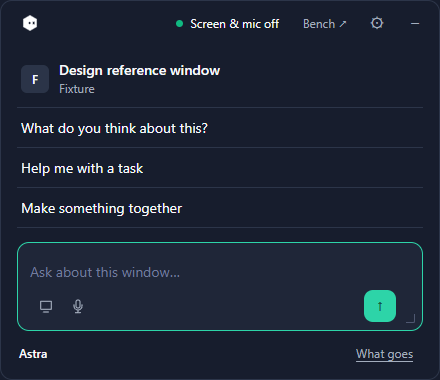
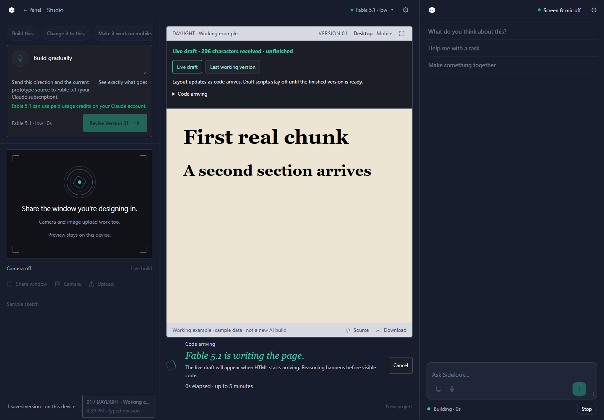
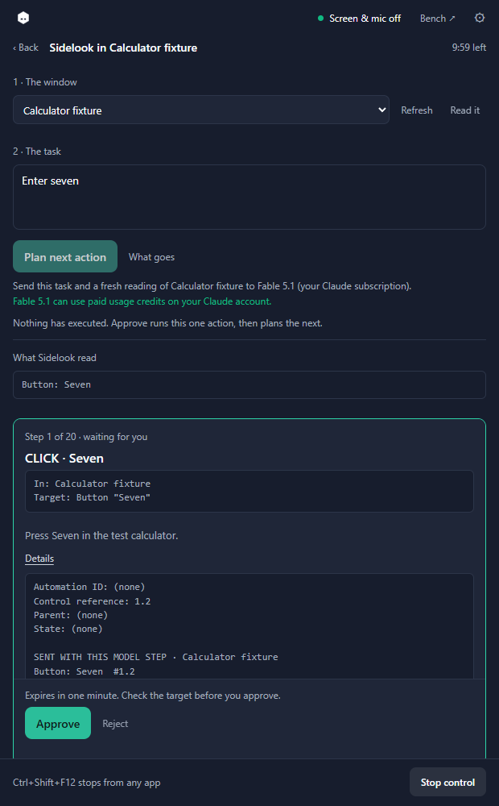

<div align="center">
  
  <h1>sidelook</h1>
  <p><strong>A desktop companion for Windows that runs on the ChatGPT or Claude subscription you already pay for, or on a local model in LM Studio or Ollama.</strong></p>
  <p>a <a href="https://practicalsystems.io">Practical Systems</a> product</p>
  <p><a href="https://github.com/ucsandman/sidelook/actions/workflows/ci.yml"></a> <a href="LICENSE"></a> <a href="https://github.com/ucsandman/sidelook/releases/latest"></a></p>
  <p><a href="https://sidelook.practicalsystems.io/">Website</a> · <a href="https://github.com/ucsandman/sidelook/releases/download/v0.17.0/Sidelook-0.17.0-Windows-x64.exe">Download for Windows</a> · <a href="#getting-started">Get started</a> · <a href="CONTRIBUTING.md">Contribute</a></p>
</div>

Sidelook sits in the corner of your screen. Hit **Ctrl+Shift+Space** and a small panel opens already knowing which window you were in, with three questions written for it. Pick one, look at the screenshot it took, press **Send with screenshot**. The panel is only as tall as what is in it and grows as you talk. Or hand it something bigger: turn a sketch into a working prototype in the studio, or let it drive a Windows app one approved click at a time. Pick any model in the catalog, OpenAI through ChatGPT, Anthropic through Claude, or a local model in LM Studio or Ollama, go. No API key, nothing metered.

It's experimental and built around how I work. Anthropic models can burn paid Claude usage credits. What your account can reach is up to your plan. The website is a walkthrough, the app is where the sign-in and generation actually happen.



*The panel at rest, from the browser check with a synthetic shell: 440 by 380 pixels, as tall as its content. Nothing was sent.*



*The studio during a build. This is the streaming check's synthetic draft, not a model reply; a real Fable build renders the same way.*

## What it does

| Surface | What it's for |
| --- | --- |
| Companion chat | Ask about the window in front of you and get a screenshot-grounded answer. |
| Builder (the studio) | Turn a sketch or a shared design window into a working prototype. |
| Computer mode | Drive one Windows app's accessible controls, one approved action at a time. |
| Agent mode | Give Sidelook a business outcome across Slack, Stripe, HubSpot and Gmail; every write is governed by DashClaw. |

**Why a ghost.** Sidelook is one node of the Practical Systems mark. Karpathy called these models ghosts, not animals: trained by imitating human documents, they see nothing until shown something. Sidelook is summoned, looks at what you show it, and goes. Its eyes follow your mouse; nothing else does.

- **Knows what was in front, and lets you change it.** The panel reads the title and process of the window you came from and shows it as a tile with the app's icon, then three starters for it: "Unstick me" for an error, "What does this output mean?" for a terminal, "Draft a reply" for mail. Press the tile to pick **Whole desktop** or any open window; the starters and Screenshot follow it. A window half off the screen or on another monitor captures whole. No pixels, no model call, until you press a starter or Screenshot.
- **Small until asked to be bigger.** No title bar; the panel is as tall as its content, about 380px when empty, and grows upward as replies arrive while the box stays put. Drag an edge and it keeps that size until the next summon. The box grows a line at a time as you type, up to eight, and a grip in the corner makes it taller. Drag the dock itself to any corner and Sidelook lives there from then on.
- **Follows your clicks when you ask it to.** Press **Screen & mic off** in the header and choose **Follow my clicks** for ten minutes: whatever window you click is the one Sidelook looks at, a thin teal border marks it, and the starters refit to that app. **Follow and keep a fresh screenshot** also puts a screenshot of that window in the box three quiet seconds after each click, so your next question already has it; it never sends on its own. The header counts down and the same line stops it, as does **Ctrl+Shift+F12**.

  
- **Reads the exact text.** Error, terminal, spreadsheet and settings starters pull the accessible text of the window you came from through the same broker as Computer mode, read-only: every character is shown in the box with a count and whether it was cut short. Nothing is armed and nothing can click.
- **Copies, never reads.** Every reply has **Copy**. The clipboard is write-only; lint fails on any clipboard read in the page or the shell.
- **The button says what goes.** No checkbox, in the panel or the studio. A screenshot or window text sits in the box as a chip, and the Send button reads **↑** with only words in the box, **Send with screenshot** or **Send with window text** with a chip; the studio's reads **Build**, **Build with frame** or **Revise Version 02 with frame**. × removes it. The line under the button names the model and whether it can spend credits, and **What goes** shows the request body, the account, and every send this session. After a send the attachment leaves the box and stays on your message as a thumbnail; press it for the exact frame or every character.
- **Asks the second question for you.** Three follow-ups under each reply. **Ctrl+Shift+E** summons, grabs the window you were in, fills the first starter, and stops at the Send button.
- **Build as you draw.** Open the studio, share your design window, turn on Live build, and Sidelook sends a snapshot after you pause and updates the prototype. Anthropic models stream HTML into a live draft; OpenAI models hand over finished messages.
- **Keep your versions.** Up to 12 stay in Sidelook's desktop profile. Restore one, read the source, download the HTML, import an old one.
- **Work inside Windows apps.** Computer mode lives in the panel. It reads the accessible controls of one window, proposes one action, and waits for your yes. [Computer mode guide](docs/COMPUTER.md).
- **Give it a business outcome, not a window.** Agent mode is its own screen: type a goal like "refund the last payment and email confirmation," and Sidelook reads Slack, resolves the Stripe customer and payment, and works the refund, the CRM update and the confirmation email in order. DashClaw decides allow, hold for you, or block before any write runs, and a second provider read confirms it after.

## Getting started

1. [Download Sidelook 0.17.0](https://github.com/ucsandman/sidelook/releases/download/v0.17.0/Sidelook-0.17.0-Windows-x64.exe) and open it. No terminal, no Node, no admin.
2. Settings opens by itself until you're signed in. Pick an OpenAI or Anthropic model and use the sign-in button. Codex ships inside. For Anthropic models, **Install official Claude Code** downloads and verifies Anthropic's runtime.
3. Press a starter or type a question, then **↑**. **Screenshot** grabs the window you came from and shows it in the box before anything leaves; the button then reads **Send with screenshot**.
4. For a prototype, press **Bench ↗** in the panel header to open the studio; it opens sized to your monitor and works down to 760x520. **Share window**, press **Use this frame** to put one still in the box, describe the product, and press **Build with frame**. The line under the box names what goes, including the selected version's source once you have one. For hands-off updates, **Live build** has its own permission dialog.

**Ctrl+Shift+Space** brings the panel back. So does the desktop or Start menu shortcut. Closing the panel leaves Sidelook in the tray; **Quit Sidelook** from the tray menu stops the server.

Windows 10/11 x64 only. Chrome or Edge for screen sharing. The download is about 164 MiB. **The exe is unsigned**, so expect the unknown-publisher prompt. The [release has a SHA-256 checksum](https://github.com/ucsandman/sidelook/releases/tag/v0.17.0) and the bundled Node and Codex are publisher-verified. [Install, update, remove](docs/WINDOWS.md).

The companion needs the Microsoft Edge WebView2 Runtime. Sidelook checks on launch and tells you where to get it if it's missing. Its WebView profile is separate from any browser profile you used with an older install, so old revisions don't show up on their own. Export the HTML from the old profile, then **Settings, Advanced, Import a saved HTML prototype**. Imports cap at 120,000 bytes and add a version when the 12-slot history has room.

## Computer mode



*Computer mode as its own screen in the panel, from the browser check with a synthetic planner. Nothing happens until Approve.*

1. Settings, **Computer mode**. Allow local inspection for ten minutes and the screen takes over the panel: the window, the task, the one action waiting for you. **Back** returns to the conversation with control still on; **Open** on the line under the box brings the screen back.
2. Open an app or pick an open window. **Read it** reads its controls locally.
3. Type the task and press **Plan next action**. The line under it names the window whose fresh reading goes with the task, and **What goes** shows the body. With no window chosen, nothing is read and the model can only propose opening Notepad, Calculator or Paint. Model and effort come from Settings.
4. Check the consequence, the window and the target; references and the full tree sit behind **Details**. **Approve** does one thing, then Sidelook reads the same window back once, locally, and shows what it observed next to what Windows accepted. If the window closed or could not be read, it says verification was unavailable. Then it plans the next step, so the next proposal is waiting for your Approve. **Reject** does nothing and ends the loop; Plan next action starts it again.
5. **Stop control** in the footer, or hit **Ctrl+Shift+F12** from anywhere. Stop doesn't undo what already ran.

A click or a key in the target app can send, delete, or buy something. Read every approval. Filters on names and commands are a safety net, not a promise that the app is trustworthy. Up to 20 model steps per session, each on your subscription or credits. [Capabilities, limits and protocol](docs/COMPUTER.md).

## Agent mode

Agent mode gives Sidelook one business outcome instead of one window, and works it across four apps: Slack for the
request, Stripe and HubSpot for the writes, Gmail for the reply. Every write is governed by DashClaw, which decides
allow, hold for a person, or block before anything runs, and a second read from the app itself confirms what
actually happened after.

1. Settings, **Agent mode**. The screen shows five app dots (Slack, Stripe, HubSpot, Gmail, DashClaw) and a goal box.
2. Type the outcome and press **Start**. Each step Sidelook takes lands as a row in the timeline: the Slack request
   found, the Stripe customer and payment matched, the refund proposed.
3. A refund, a CRM update or a sent email is a governed write. A held write renders the **DashClaw policy approval**
   card (app, operation, customer, amount, the agent's reason, the source evidence, the policy reason, the risk
   score, the action id) with **Approve** and **Reject**; the same decision can be made on the DashClaw dashboard
   instead.
4. Every write that runs is read back from the provider before it counts as done. The run ends with a **summary
   block**: apps touched, tool calls, writes planned and verified, approvals, duplicate side effects, and anything
   left unresolved.
5. **Stop** in the footer, or **Ctrl+Shift+F12**, ends the run; a write already in flight finishes its own
   verification, and nothing new starts.

An operational fault (a timeout, a rate limit, a dead token, a restart) heals itself where it safely can: the
timeline narrates the recovery as it happens ("Checking previous effects," "Retrying HubSpot safely," "Recovered"),
a repeated fault pauses that app's dot amber with the reason until it clears on its own, and a run that ends with
its goal still unmet stays on the record rather than silently retrying something already done.

**Diagnostics**, a button on a finished run's summary block, reveals exactly what went wrong and what Sidelook did
about it: the incident list (which app, which kind of fault, what recovery was tried, how it ended) and any paused
app. **Continue**, on a run whose goal is unmet, starts a fresh run that picks up from there: a write already
verified is never repeated, and a write left uncertain is read back from the provider before anything new happens.

Sidelook does not learn from its own runs while it is running. A separate, offline loop (`agent-learning/`, run
by a person from a terminal) reads what past runs recorded, turns a repeated failure into a regression test, and,
given a generator model (`-- --model <id>`, or `--fixtures` for a canned run), tries a fix as an isolated candidate
that must pass every existing safety check and an independent review before a person can merge it: `npm run
agent:learn` (add `-- --model <id>` to generate and evaluate a candidate, or `-- --dry-run` to see what it would do
without changing anything), `npm run verify:learn` (the same loop end to end against a fixed, canned corpus, useful
as a demo or a CI check), `npm run agent:regress` (just runs the accumulated regression corpus), and `npm run
agent:learn:nightly` (one locked, deadline-limited run with a status file; `scripts/install-agent-learn-task.ps1
-Apply` registers it as a daily 02:30 Windows task, and a night never merges anything). With no model
given, bare `npm run agent:learn` stops after hypotheses, memory and the report: it proposes no candidate. Reading
evidence and proposing hypotheses run on their own regardless; candidate creation, evaluation and review need a
generator model; only merging a candidate's branch, or any change to the DashClaw policy or the protected
governance code, needs a person.

[Set it up](docs/HACKATHON_SETUP.md) · [Watch the two-minute demo](docs/HACKATHON_DEMO.md).

## Models and speed

| Model | Account | Preview while generating |
| --- | --- | --- |
| OpenAI models (Astra, GPT-5.6 Sol, Terra, Luna, GPT-5.5, GPT-5.4 Mini, GPT-5.3 Codex Spark) | ChatGPT subscription through Codex | Updates when the CLI finishes a message |
| Anthropic models (Fable 5.1, Opus 5, Sonnet 5, Haiku 4.5) | Paid Claude subscription through Claude Code | HTML drafts as chunks arrive |
| Local models (whatever LM Studio or Ollama holds) | Your own computer, through Codex's open-source provider | Updates when the CLI finishes a message |

Model and effort live in **Settings**; effort is under **Advanced**. Start on **low effort** for small changes. High effort can take a while.

Streaming doesn't skip the thinking time. One small Fable/low probe showed first HTML at 18.9s and finished at 20.5s. An earlier screen-based build took 60s. Different requests, not a benchmark. [Model and billing details](docs/MODELS.md).

## Live build

Live build compares small thumbnails locally. It waits for three quiet seconds and a real change, one request at a time. Minimum gap is **30 seconds**, **60 seconds**, or **two minutes**. It pauses after **ten builds per start**, when capture drops, or after an interrupted build. While it's on, the sharing line in the studio says so instead of showing a tick.

**Pause** stops snapshots and cancels the in-flight request. **Stop sharing** also releases capture. Reload never restarts sharing or Live build. Work the provider already received may still count against you.

Share the design window, not Sidelook, or you'll capture yourself. Animated windows may never settle. Drafts are visual only until a finished result validates. A new finished version resets the prototype's runtime data; saved source stays.

## Privacy and boundaries

| What | What happens |
| --- | --- |
| Window text | A text starter puts the accessible controls and values of one window in the box, every character shown, and they go with the next Send while the chip is there. Read-only; Computer mode stays off. |
| Clipboard | Copy writes a reply to it. Nothing reads it. |
| Which window Sidelook looks at | The shell keeps the title and process name of the window that was in front, or the one you picked with **change**, only to pick starter labels and the capture target. **change** lists the titles and app names of open windows; no pixels. Nothing sends the title without a screenshot or text. A pick lasts until the next summon. **Whole desktop** captures every monitor with the panel hidden. |
| Screen on | Off until you press the header line. While on, the shell watches mouse button-ups only (no keys, no coordinates kept), pins the window under each click, and reads the clicked control's accessible name and type, never its value. Screenshots land in the box and wait for Send. Ten minutes, a countdown, the border on the desktop, and one press to stop. |
| Camera and screen | Preview stays local and attaches nothing. A panel message sends the screenshot in the box, if any; a build sends the one frame attached in the box, taken with **Use this frame**. Live build sends changed snapshots after its own permission. No video stream, no desktop audio. |
| Model input | Your message or direction, the screenshot in the box and the selected source go to the provider through its official CLI. The Send button names the attachment; **What goes** shows the body. |
| Accounts | The CLI owns sign-in. Sidelook never reads credential files, never takes an API key, never falls back to another model. |
| Drafts | Partial HTML isn't saved. Scripts are off. Draft URLs expire when the build ends. Reasoning and raw CLI logs aren't shown. |
| Finished prototypes | Run in a locked-down iframe: no network, no nested frames, no camera or mic. Downloaded HTML runs outside that box. |
| Computer mode | Window choice is local. **Plan next action** sends a fresh bounded accessibility tree, editable values, the task and recent actions; the line under the button says so. No screenshot, no audio. History is session-only. |
| Saved work | Versions and reference images live in Sidelook's desktop profile on this machine. |
| Sent this session | The ledger in **What goes** lists every send and every refusal. It resets when Sidelook reloads. |
| Agent mode | The goal and each tool's observations go to the model through the same local session as every other surface. DashClaw sees the method, the URL and a redacted body excerpt for every governed write, never a header, a token or a cookie. Slack, Stripe, HubSpot and Gmail credentials stay in the server process and never reach the model. Runs save to Sidelook's own data folder on this machine, redacted the same way, one file per run. |

The builder makes frontend pages. Computer mode, enabled separately, drives accessible Windows controls with per-action approval. It is not general desktop automation: no canvas, no Explorer, no address bars, no terminals, no admin prompts. No shell tool, no repo editing, no backend, no deploy. Read generated output before you use it somewhere else. [Security details and reporting](SECURITY.md).

## Run from source

Needs **Node.js 24+** and a subscription, or a local model in LM Studio or Ollama, for generation. Setup can install the CLI on Windows. Elsewhere, install the official CLI yourself. [Provider setup](docs/MODELS.md).

```sh
git clone https://github.com/ucsandman/sidelook.git
cd sidelook
npm ci
npm start
```

Open **http://127.0.0.1:4317**. One runtime dependency, the official DashClaw SDK, used only by Agent mode. **Start Sidelook.cmd** works too once Node is installed. In a plain browser the studio opens first; add `?companion` to start in the panel.

## Development and verification

```sh
npm test
npm run lint
npm run build
npm run verify:assistant
npm run verify:companion
npm run verify:states
npm run verify:computer
npm run verify:recovery
npm run verify:stream
node scripts/verify-live.mjs
node scripts/verify-models.mjs
node scripts/verify-desktop-content.mjs
npm run verify:mark
npm run eval:agent
npm run verify:agent
```

Browser checks need Chrome plus Playwright or a global `@playwright/cli`. They use synthetic generation and don't touch your allowance. Live-provider checks are separate and do. `npm run lint` also checks that every served asset exists, every local reference is served, and nothing in `public/*.css` is set below 12px. `npm run verify:mark` (Windows; compiles the mark and the profile migration). CI runs install, tests, lint and build on Windows and Linux.

Prewritten prompts live in `public/chips.js`. The activity and sensor lines, the Send label, the studio's sharing sentence, the gate and the ledger live in `public/harness.js` and are unit-tested in `tests/harness.test.mjs`.

Changed the mark? Run `powershell -NoProfile -File scripts/build-icon.ps1` to regenerate `desktop/sidelook.ico`.

[Contributing](CONTRIBUTING.md) · [Changelog](CHANGELOG.md) · [Windows packaging](docs/WINDOWS.md) · [Site runbook](docs/SITE.md) · [Verification history](PLAYBOOK.md)

## Troubleshooting

| Problem | Try |
| --- | --- |
| Slow generation | Drop to low effort in Settings, Advanced, ask for less, or cancel. Anthropic models stream drafts; OpenAI models stay quiet until they're done. |
| Model or login unavailable | Open Settings, use the sign-in or install button, then Check again. |
| Send is greyed out | The line under the box says why: reconnect, sign in, or start a new allowance in Settings. |
| The starters don't match the window | Press the tile at the top of the panel and pick the window, or **Whole desktop** for the generic three. |
| A minimized window flashed on screen | Sidelook shows it without taking focus, captures it, then minimizes it again. Pick it from the tile, where the picker marks it "minimized". |
| The panel is the wrong size | Drag an edge; that size stays until the next summon, when it fits its content again. |
| Ctrl+Shift+E does nothing | Another app owns it. Settings says so at the bottom; Ctrl+Shift+Space still works. |
| Can't share the screen | Use Chrome or Edge, upload an image, or use the camera. |
| Live build paused | Read the message, check the shared window and your allowance, start it again yourself. |
| Preview failed | Retry preview or download the source. Don't regenerate just to reopen it. |
| Saved work missing | Same installed Sidelook profile? Older browser installs are separate. Export there, then **Settings, Advanced, Import a saved HTML prototype**. |
| Port taken | Quit whatever is on 4317, reopen Sidelook. |

## License

Sidelook is [MIT](LICENSE). Node.js, Codex and Claude Code keep their own licenses. Upstream notices ship with the bundled runtimes; Claude Code is downloaded separately through Setup. Plus Jakarta Sans is licensed under the SIL Open Font License 1.1 (site/plus-jakarta-sans-OFL.txt).
