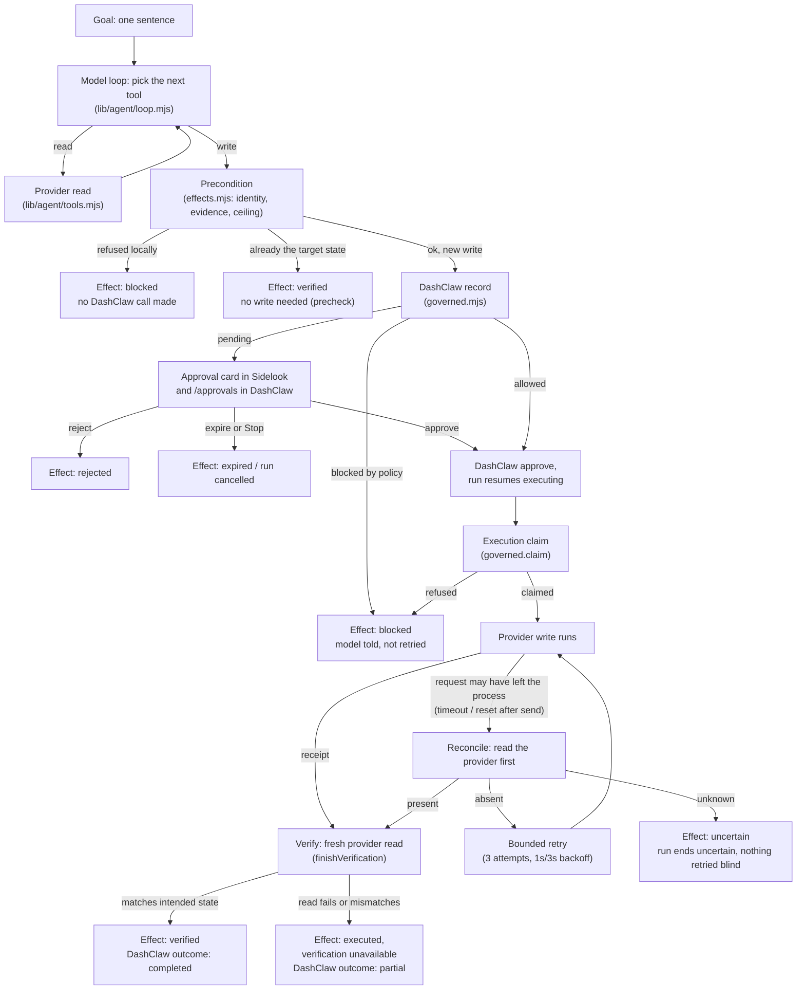
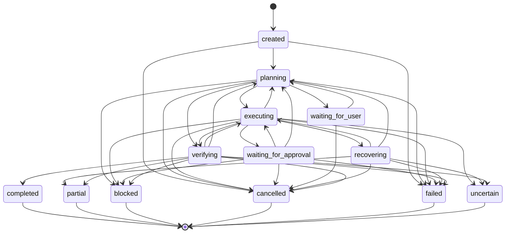

# Agent mode: architecture

Agents that can call an API are not new and are not the hard part. The hard part is a workflow that touches several
real systems on the way to one business outcome (a Slack request, a Stripe refund, a CRM update, a confirmation
email) without silently leaving the world in the wrong state: a refund sent twice, a customer told something untrue,
a write that half-happened and nobody noticed. Agent mode is Sidelook's answer to that second problem, not the
first one. Everything below exists to make one claim checkable: if Sidelook says a write is verified, a fresh read
from the provider itself agrees, and if it says "governed," DashClaw decided before anything ran.

## The five layers

1. **Sidelook panel** (`public/agent.js`). Renders whatever the runtime last reported. It never decides what
   executed; a page refresh re-fetches the run and redraws it from scratch.
2. **The runtime** (`lib/agent/index.mjs`, `loop.mjs`, `planner.mjs`, `tools.mjs`). One `AgentRuntime` per server
   process. Runs a bounded model loop, one tool call per turn, up to 14 turns, against a finite tool registry.
3. **DashClaw** (`lib/agent/governed.mjs`, the official `dashclaw` npm SDK). Decides, for every consequential write,
   whether it may run now, needs a person, or is blocked outright. Sidelook never writes anywhere DashClaw has not
   seen.
4. **The four app APIs** (`lib/agent/providers/{slack,stripe,hubspot,gmail}.mjs`). Do the actual work: read the
   Slack request, refund the Stripe payment, update the HubSpot contact, send the Gmail reply. Credentials live
   only here.
5. **Verification** (`lib/agent/effects.mjs`, `facts.mjs`). Reads each provider back after a write and proves what
   happened. "The API call returned" is never the same thing as "verified" anywhere in this codebase.

## One governed write, goal to verified state

The approval branch (`F → H → I/J/K`) and the reconciliation branch (`M → O → N/P/Q`) are the two places a naive
"call the API" agent goes wrong: approving nothing skips the human, and retrying blind after a lost response risks
a second refund. Both are handled once, in `lib/agent/effects.mjs`, for every write.

## Module map

| Module | One line |
| --- | --- |
| `lib/agent/run.mjs` | Pure run state: creation, transitions, the event/effect/approval ledgers, the terminal status derivation. No I/O. |
| `lib/agent/store.mjs` | Atomic one-file-per-run JSON persistence; redacts on write; marks interrupted runs `uncertain`/`blocked` on restart, never resumes a model loop blind. |
| `lib/agent/planner.mjs` | The system prompt, the flat output schema every model transport fills, and the parser that turns one reply into a plan or a typed rejection. |
| `lib/agent/tools.mjs` | The finite tool registry: argument validation, opKey formulas, and every read-only handler. No write handler lives here. |
| `lib/agent/effects.mjs` | The governed effect engine: the only path in Sidelook that can perform a write. Precondition, DashClaw record, approval wait, claim, execute, verify, reconcile. |
| `lib/agent/loop.mjs` | The bounded model loop: one tool call per turn, up to `MAX_TURNS` (14), dispatches reads to `tools.mjs` and writes to `effects.mjs`. |
| `lib/agent/governed.mjs` | The DashClaw seam. Wraps the official SDK; nothing else in the codebase talks to DashClaw directly. |
| `lib/agent/facts.mjs` | Turns the verified-fact ledger into the model's `verifiedFacts` and DashClaw's non-fabrication source of truth for the confirmation email. |
| `lib/agent/http.mjs` | Fetch with a timeout, a typed provider error taxonomy (`AUTH`/`NOT_FOUND`/`RATE_LIMIT`/`SERVER`/`TIMEOUT`/`NETWORK`/`INVALID`/`CONFIG`), and bounded read retries. Writes never retry here. |
| `lib/agent/redact.mjs` | Secret patterns scrubbed from anything stored or emitted; defense in depth, not the only barrier. |
| `lib/agent/config.mjs` | Loads `.env` (Agent mode is the only surface that reads it), classifies the Stripe key test/live, carries the failure-injection flags. |
| `lib/agent/health.mjs` | Probes all five integrations in parallel, bounded to 6s each, never throws. |
| `lib/agent/index.mjs` | The `AgentRuntime`: one per process, owns every run, the only thing `/api/agent` talks to. |
| `lib/agent/providers/{slack,stripe,hubspot,gmail}.mjs` | Typed adapters: request building, response parsing, provider idempotency, reconciliation reads. |
| `server.mjs` (`/api/agent` route) | Relays operations to the runtime and streams run snapshots (ndjson); same Host/Origin/session checks as every other route. |
| `public/agent.js` | Draws the screen from run snapshots: the timeline, the approval card, the clarification box, the summary block. Holds no execution state of its own. |
| `eval/*` | Fake DashClaw, fixture providers with fault injection, and a scripted model that prove the reliability claims without a real network call. |

## Run states

Reproduced exactly from `ALLOWED` and `TERMINAL` in `lib/agent/run.mjs`. Every `transition()` call checks this table
and throws `IllegalTransition` on anything not listed; the loop treats that throw as a runtime bug and fails the
run, never a silent skip.

## Tool registry

| Tool | Read or write | Notes |
| --- | --- | --- |
| `slack.find_customer_request` | read | Searches the configured channels for the newest message naming the customer; scans every message for prompt injection; wraps the text `{untrusted:true}`. |
| `slack.get_message_context` | read | Bounded thread replies under one message, also scanned and wrapped untrusted. |
| `stripe.find_customer` | read | One match resolves `entities.stripeCustomer`; several become `stripeCandidates` the model must ask about. |
| `stripe.get_recent_payments` | read | Succeeded payments, newest first, with refund eligibility computed from amount received minus amount refunded. |
| `stripe.get_payment` | read | One payment intent and its latest charge. |
| `stripe.refund_payment` | **write, financial** | Governed. Precondition: a Slack request fact, one resolved Stripe customer, the payment observed by a tool, refundable, under the configured ceiling or a live-key block. Verify: a fresh `GET /v1/refunds/{id}`. |
| `stripe.get_refund` | read | One refund by id. |
| `hubspot.find_customer` | read | One match resolves `entities.hubspotContact`. |
| `hubspot.get_customer` | read | Current value of the configured status property. |
| `hubspot.update_customer` | **write, low risk** | Governed. Only the configured property and an allow-listed value. A precheck read that already matches is recorded as verified with zero write attempts. |
| `hubspot.verify_customer_state` | read | Exposes the read-back to the model directly. |
| `gmail.prepare_message` | read (no effect) | Mints a deterministic Message-ID, runs DashClaw's non-fabrication check against the run's verified facts, and records recipient confidence (high only if the address matches Stripe or HubSpot on file). |
| `gmail.send_message` | **write, external** | Governed. Sends exactly the prepared message; a low-confidence recipient carries `risk_score:92`. Verify: a Gmail search by Message-ID under Sent. |
| `gmail.find_sent_message` | read | Search by Message-ID. |

No tool takes a URL, a header, a raw body or a secret. The runtime constructs every request from arguments the
tool's own `validate()` accepted.

## Policy pack

Installed by `npm run agent:setup-dashclaw` (`scripts/agent-setup-dashclaw.mjs`), every row scoped to
`DASHCLAW_AGENT_ID` only:

| Name | Type | Rule | Effect |
| --- | --- | --- | --- |
| `sidelook-agent: refunds need a human` | `protected_path` | paths `["**/v1/refunds*"]`, `require_approval` | Every Stripe refund is held for a person, always. |
| `sidelook-agent: hold when the agent is unsure` | `risk_threshold` | threshold 90, `require_approval` | A low-confidence email (risk 92) is held. |
| `sidelook-agent: block over the ceiling` | `risk_threshold` | threshold 100, `block` | A refund over `AGENT_REFUND_MAX_CENTS`, or any live-mode refund, is blocked outright. |
| `sidelook-agent: no fabricated email` | `non_fabrication` | `action_types: ['email']`, block on violation | The email body must trace to the run's verified facts. |
| `sidelook-agent: only api and email` | `role_constraint` | allowed types `['api','email']`, block otherwise | Any other declared action type is blocked. |
| `sidelook-agent: writes carry evidence` | `require_evidence` | `action_types: ['api','email']`, block otherwise | A declaration with no `act` attached is blocked. |

Reads never reach DashClaw; they stay in Sidelook's own trace. Full contract: `docs/AGENT_MODE_IMPLEMENTATION.md`.
